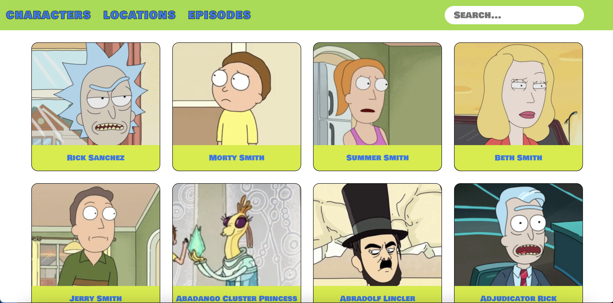
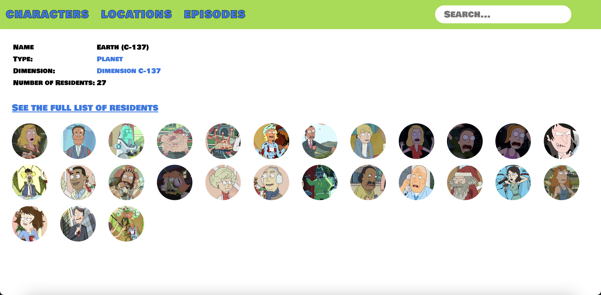

# Description:
Introducing the "Rick and Morty" project, your ultimate go-to for everything related to the beloved animated series. This comprehensive resource offers a wealth of information on the show's characters, locations, and episodes. Easily explore and discover your favorite characters with the project's convenient search feature.

# Technologies Used:
A list of the languages, libraries and frameworks used in your application.

# Getting Started/Installation Instructions:
This would likely describe how to use the application and the steps to fork, clone and run the application.

# Contribution Guidelines:
This section should offer guidance on where and how users can contribute to your code, identify bugs, and propose improvements.